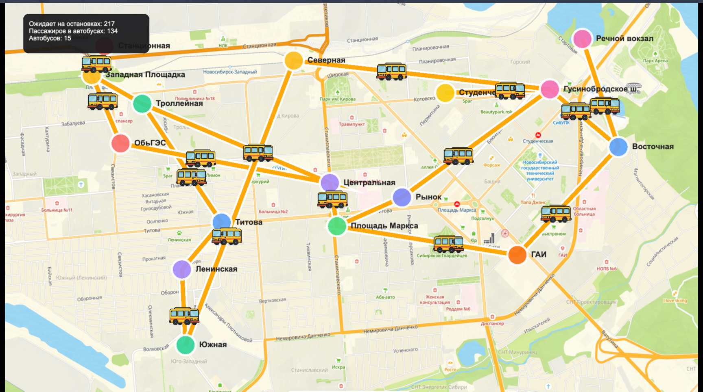

# 🚍 Bus City Visualization — Interactive PixiJS City Transit Simulator

Веб-приложение для интерактивной визуализации движения автобусов по городским маршрутам с помощью **PixiJS 8** и **TypeScript**.  
Масштабируемая карта, анимированные автобусы, интерактивные станции и дашборд с live-статистикой.



---

## Функционал

- **Городская карта** с маршрутами и станциями
- **Анимированные автобусы**, двигающиеся туда-обратно по своим маршрутам
- **Пассажиры**: отображается число ожидающих на каждой остановке, число севших и текущая загруженность автобусов
- **Дашборд** — агрегированная статистика по всей системе
- **Интерактивность**: тултипы при наведении на автобус и станцию
- **Адаптивность**: сцена всегда по центру, работает на любых экранах

---

## Локальный запуск

```bash
# 1. Установите зависимости
npm install

# 2. Запустите dev-сервер
npm run dev
